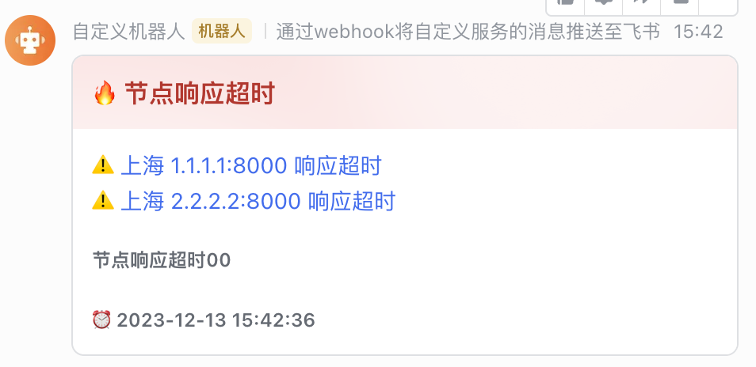

### 部署

1. 配置 alertmanager webhook
```yaml
global:
  resolve_timeout: 5m

receivers:
  - name: 平台报警
    webhook_configs:
      - send_resolved: false
        url: http://localhost:8201/lark_platform_alert
route:
  receiver: 平台报警
```

2. 配置路由后启动 lark_adapter.py


### 运行效果
⚠️
1. 需要先[配置报警机器人](../tutorial/lark_robot.md)
2. 将机器人 webhook 修改到脚本里

```
# 窗口一
python3 lark_adapter.py

# 窗口二
python3 test.py
```

